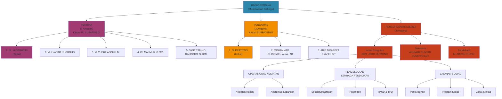
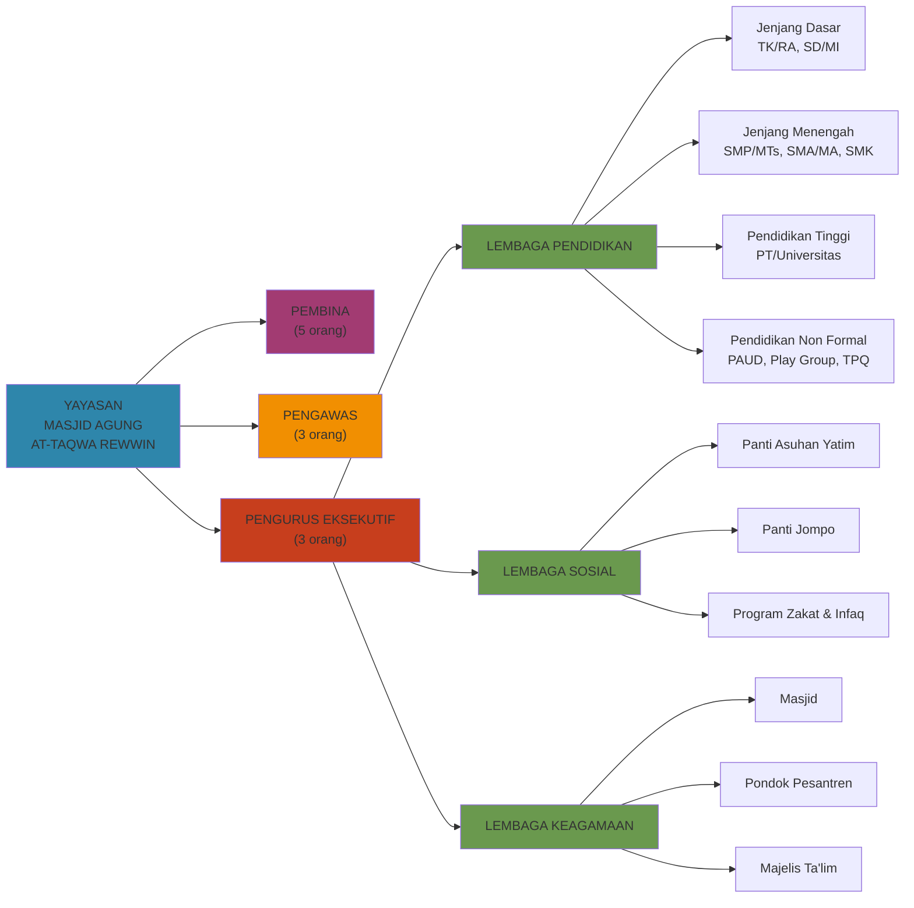

# Struktur Organisasi Yayasan Masjid Agung At-Taqwa Rewwin

## Periode 2024-2029

Berdasarkan Pernyataan Keputusan Rapat (Nomor 34, tanggal 14 Maret 2024), berikut adalah susunan pengurus Yayasan untuk periode 2024-2029:

---

## A. Struktur Organisasi Tekstual

### PEMBINA (Pengawas Tertinggi)

Badan Pembina terdiri dari **5 (lima) orang anggota**:

| No. | Jabatan | Nama |
|-----|---------|------|
| 1 | **Ketua Pembina** | IR. YUSARWEDI |
| 2 | Anggota Pembina | MULYANTO NUGROHO |
| 3 | Anggota Pembina | M. YUSUF ABDULLAH |
| 4 | Anggota Pembina | IR. MAKMUR YUSRI |
| 5 | Anggota Pembina | SIGIT TJAHJO HANDOKO, S.KOM |

### PENGAWAS

Badan Pengawas terdiri dari **3 (tiga) orang anggota**:

| No. | Jabatan | Nama |
|-----|---------|------|
| 1 | **Ketua Pengawas** | SUPRAYITNO |
| 2 | Anggota Pengawas | MOHAMMAD CHISQYIEL, A.ma., ST |
| 3 | Anggota Pengawas | ARIE DIPAREZA SYAFEI, S.T |

### PENGURUS (Eksekutif)

Badan Pengurus terdiri dari **3 (tiga) orang anggota**:

| No. | Jabatan | Nama |
|-----|---------|------|
| 1 | **Ketua Pengurus / Direktur** | DRS. JOKO SUTARNO |
| 2 | **Sekretaris** | AKHMAD GUNTAR SUSATYO ADY |
| 3 | **Bendahara** | M. ABROR THO'AT |

---

## B. Daftar Lengkap Pengurus

### Anggota Pembina Baru (Dipilih/Diangkat)

1. IR. YUSARWEDI
2. MULYANTO NUGROHO
3. M. YUSUF ABDULLAH
4. SUPRAYITNO
5. MOHAMMAD CHISQYIEL, A.ma., ST
6. ARIE DIPAREZA SYAFEI, S.T
7. DRS. JOKO SUTARNO
8. IR. MAKMUR YUSRI
9. AKHMAD GUNTAR SUSATYO ADY
10. SIGIT TJAHJO HANDOKO, S.KOM
11. M. ABROR THO'AT

### Pengesahan Ketua Pengurus

Dikarenakan **MOCHAMAD TRIONO BUDI SANTOSO** meninggal dunia (berdasarkan Kutipan Akta Kematian Nomor: 3578-KM-19082021-0260, tanggal 19 Agustus 2020), maka dilakukan pengesahan atas pengganti ketua pengurus untuk periode baru.

---

## C. Diagram Struktur Organisasi

### Bagan Organisasi

### Hubungan Antar Lembaga

---

## D. Fungsi dan Tugas Pokok

### Pembina
- Memberikan pembinaan dan arahan strategis kepada pengurus
- Mengawasi jalannya kegiatan yayasan secara umum
- Memberikan persetujuan atas keputusan-keputusan penting
- Menjadi jembatan antara yayasan dengan stakeholder eksternal

### Pengawas
- Melakukan pengawasan terhadap pelaksanaan keputusan pembina dan pengurus
- Memeriksa keuangan yayasan
- Memberikan laporan hasil pengawasan secara berkala
- Memastikan kepatuhan terhadap peraturan yang berlaku

### Pengurus (Direktur/Ketua)
- Memimpin dan mengelola kegiatan operasional yayasan
- Bertanggung jawab atas pelaksanaan program-program yayasan
- Membuat laporan pertanggungjawaban kepada pembina dan pengawas

### Sekretaris
- Mengelola administrasi dan dokumentasi yayasan
- Mengatur jadwal rapat dan kegiatan
- Mempersiapkan segala dokumen yang diperlukan

### Bendahara
- Mengelola keuangan dan aset yayasan
- Membuat laporan keuangan berkala
- Memastikan semua pengeluaran sesuai dengan peraturan dan persetujuan yang ada

---

## E. Catatan

**Periode:** 2024-2029 (Lima Tahun)

**Tanggal Penetapan:** 14 Maret 2024 (Rapat Pembina)

**Notaris:** SITI MUNDIROH, S.H., M.Hum., M.Kn.
(Kantor Notaris - PPAT Kabupaten Sidoarjo)

Dokumen legal: Akta Pernyataan Keputusan Rapat Nomor 34, tanggal 14 Maret 2024

---

## F. Riwayat Pengurus

### Perubahan Kepemimpinan
- **Pengganti Ketua Pengurus:** DRS. JOKO SUTARNO menggantikan MOCHAMAD TRIONO BUDI SANTOSO yang meninggal dunia pada tanggal 19 Agustus 2020
- **Perubahan Status:** Dikarenakan ketua pengurus sebelumnya meninggal, dilakukan pengesahan dan penggantian struktur pengurus pada rapat pembina 2024
